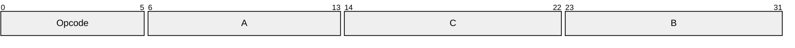
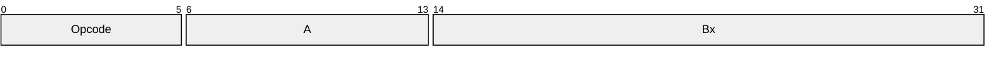

# Lua51

```lua
local a = 1
local x = a + 2
```

をluacでコンパイルしたあとに`luac -l`で閲覧

```bin
main <add.lua:0,0> (5 instructions, 20 bytes at 0x425860)
0+ params, 2 slots, 0 upvalues, 1 local, 3 constants, 0 functions
        1       [1]     LOADK           0 -2    ; 1
        2       [1]     SETGLOBAL       0 -1    ; a
        3       [2]     GETGLOBAL       0 -1    ; a
        4       [2]     ADD             0 0 -3  ; - 2
        5       [2]     RETURN          0 1
```

```
00000000: 1b4c 7561 5100 0104 0804 0800 0900 0000  .LuaQ...........
00000010: 0000 0000 4061 6464 2e6c 7561 0000 0000  ....@add.lua....
00000020: 0000 0000 0000 0002 0205 0000 0001 4000  ..............@.
00000030: 0007 0000 0005 0000 000c 8040 001e 0080  ...........@....
00000040: 0003 0000 0004 0200 0000 0000 0000 6100  ..............a.
00000050: 0300 0000 0000 00f0 3f03 0000 0000 0000  ........?.......
00000060: 0040 0000 0000 0500 0000 0100 0000 0100  .@..............
00000070: 0000 0200 0000 0200 0000 0200 0000 0100  ................
00000080: 0000 0200 0000 0000 0000 7800 0400 0000  ..........x.....
00000090: 0400 0000 0000 0000 0a                   .........
```

Header
```
1b4c 7561 51 : \EscLua51
00 : format version
01 : endian
04 : int_size
08 : size_t_size
04 : inst_size
08 : number_size
00 : integral
```
Proto
```
0900 0000 0000 0000    : name length = 9
4061 6464 2e6c 7561 00 : @add.lua
00 0000 00 : first_line
00 0000 00 : last_line
00 : num_upval
00 : num_params
02 : is_varg
02 : max_stack_size
05 0000 0001 4000
00000030: 0007 0000 0005 0000 000c 8040 001e 0080  ...........@....
00000040: 0003 0000 0004 0200 0000 0000 0000 6100  ..............a.
```

```lua
function calc(x)
    local a = x + 2
    return a * a
end
print(calc(12))
```

`luac -l -l function.lua`
```bin
main <function.lua:0,0> (8 instructions, 32 bytes at 0x425860)
0+ params, 3 slots, 0 upvalues, 0 locals, 3 constants, 1 function
        1       [4]     CLOSURE         0 0     ; 0x425a40
        2       [1]     SETGLOBAL       0 -1    ; calc
        3       [5]     GETGLOBAL       0 -2    ; print
        4       [5]     GETGLOBAL       1 -1    ; calc
        5       [5]     LOADK           2 -3    ; 12
        6       [5]     CALL            1 2 0
        7       [5]     CALL            0 0 1
        8       [5]     RETURN          0 1
constants (3) for 0x425860:
        1       "calc"
        2       "print"
        3       12
locals (0) for 0x425860:
upvalues (0) for 0x425860:

function <function.lua:1,4> (4 instructions, 16 bytes at 0x425a40)
1 param, 3 slots, 0 upvalues, 2 locals, 1 constant, 0 functions
        1       [2]     ADD             1 0 -1  ; - 2
        2       [3]     MUL             2 1 1
        3       [3]     RETURN          2 2
        4       [4]     RETURN          0 1
constants (1) for 0x425a40:
        1       2
locals (2) for 0x425a40:
        0       x       1       4
        1       a       2       4
upvalues (0) for 0x425a40:
```

# Register Machine
> [!NOTE] **Reference**
> [The Implementation of Lua5.0](https://www.lua.org/doc/jucs05.pdf)
> [Lua 5.3 Bytecode Reference](https://the-ravi-programming-language.readthedocs.io/en/stable/lua_bytecode_reference.html)

# Tools
[Lua bytecode explorer](https://www.luac.nl/)

# Instructions
[lua-bytecode](https://openpunk.com/pages/lua-bytecode-parser/)

## Lua5.1


iABC


iABx


iAsBx


# Comparison Opcodes

## [Lua5.1](https://www.lua.org/source/5.1/lopcodes.h.html)
```c
/*----------------------------------------------------------------------
name            args    description
------------------------------------------------------------------------*/
OP_MOVE,/*      A B     R(A) := R(B)                                    */
OP_LOADK,/*     A Bx    R(A) := Kst(Bx)                                 */
OP_LOADBOOL,/*  A B C   R(A) := (Bool)B; if (C) pc++                    */
OP_LOADNIL,/*   A B     R(A) := ... := R(B) := nil                      */
OP_GETUPVAL,/*  A B     R(A) := UpValue[B]                              */

OP_GETGLOBAL,/* A Bx    R(A) := Gbl[Kst(Bx)]                            */
OP_GETTABLE,/*  A B C   R(A) := R(B)[RK(C)]                             */

OP_SETGLOBAL,/* A Bx    Gbl[Kst(Bx)] := R(A)                            */
OP_SETUPVAL,/*  A B     UpValue[B] := R(A)                              */
OP_SETTABLE,/*  A B C   R(A)[RK(B)] := RK(C)                            */

OP_NEWTABLE,/*  A B C   R(A) := {} (size = B,C)                         */

OP_SELF,/*      A B C   R(A+1) := R(B); R(A) := R(B)[RK(C)]             */

OP_ADD,/*       A B C   R(A) := RK(B) + RK(C)                           */
OP_SUB,/*       A B C   R(A) := RK(B) - RK(C)                           */
OP_MUL,/*       A B C   R(A) := RK(B) * RK(C)                           */
OP_DIV,/*       A B C   R(A) := RK(B) / RK(C)                           */
OP_MOD,/*       A B C   R(A) := RK(B) % RK(C)                           */
OP_POW,/*       A B C   R(A) := RK(B) ^ RK(C)                           */
OP_UNM,/*       A B     R(A) := -R(B)                                   */
OP_NOT,/*       A B     R(A) := not R(B)                                */
OP_LEN,/*       A B     R(A) := length of R(B)                          */

OP_CONCAT,/*    A B C   R(A) := R(B).. ... ..R(C)                       */

OP_JMP,/*       sBx     pc+=sBx                                 */
OP_EQ,/*        A B C   if ((RK(B) == RK(C)) ~= A) then pc++            */
OP_LT,/*        A B C   if ((RK(B) <  RK(C)) ~= A) then pc++            */
OP_LE,/*        A B C   if ((RK(B) <= RK(C)) ~= A) then pc++            */

OP_TEST,/*      A C     if not (R(A) <=> C) then pc++                   */ 
OP_TESTSET,/*   A B C   if (R(B) <=> C) then R(A) := R(B) else pc++     */ 

OP_CALL,/*      A B C   R(A), ... ,R(A+C-2) := R(A)(R(A+1), ... ,R(A+B-1)) */
OP_TAILCALL,/*  A B C   return R(A)(R(A+1), ... ,R(A+B-1))              */
OP_RETURN,/*    A B     return R(A), ... ,R(A+B-2)      (see note)      */

OP_FORLOOP,/*   A sBx   R(A)+=R(A+2);
                        if R(A) <?= R(A+1) then { pc+=sBx; R(A+3)=R(A) }*/
OP_FORPREP,/*   A sBx   R(A)-=R(A+2); pc+=sBx                           */

OP_TFORLOOP,/*  A C     R(A+3), ... ,R(A+2+C) := R(A)(R(A+1), R(A+2)); 
                        if R(A+3) ~= nil then R(A+2)=R(A+3) else pc++   */ 
OP_SETLIST,/*   A B C   R(A)[(C-1)*FPF+i] := R(A+i), 1 <= i <= B        */

OP_CLOSE,/*     A       close all variables in the stack up to (>=) R(A)*/
OP_CLOSURE,/*   A Bx    R(A) := closure(KPROTO[Bx], R(A), ... ,R(A+n))  */

OP_VARARG/*     A B     R(A), R(A+1), ..., R(A+B-1) = vararg            */
```

## [Lua5.2](https://www.lua.org/source/5.2/lopcodes.h.html)
```c
/*----------------------------------------------------------------------
name            args    description
------------------------------------------------------------------------*/
OP_MOVE,/*      A B     R(A) := R(B)                                    */
OP_LOADK,/*     A Bx    R(A) := Kst(Bx)                                 */
OP_LOADKX,/*    A       R(A) := Kst(extra arg)                          */
OP_LOADBOOL,/*  A B C   R(A) := (Bool)B; if (C) pc++                    */
OP_LOADNIL,/*   A B     R(A), R(A+1), ..., R(A+B) := nil                */
OP_GETUPVAL,/*  A B     R(A) := UpValue[B]                              */

OP_GETTABUP,/*  A B C   R(A) := UpValue[B][RK(C)]                       */
OP_GETTABLE,/*  A B C   R(A) := R(B)[RK(C)]                             */

OP_SETTABUP,/*  A B C   UpValue[A][RK(B)] := RK(C)                      */
OP_SETUPVAL,/*  A B     UpValue[B] := R(A)                              */
OP_SETTABLE,/*  A B C   R(A)[RK(B)] := RK(C)                            */

OP_NEWTABLE,/*  A B C   R(A) := {} (size = B,C)                         */

OP_SELF,/*      A B C   R(A+1) := R(B); R(A) := R(B)[RK(C)]             */

OP_ADD,/*       A B C   R(A) := RK(B) + RK(C)                           */
OP_SUB,/*       A B C   R(A) := RK(B) - RK(C)                           */
OP_MUL,/*       A B C   R(A) := RK(B) * RK(C)                           */
OP_DIV,/*       A B C   R(A) := RK(B) / RK(C)                           */
OP_MOD,/*       A B C   R(A) := RK(B) % RK(C)                           */
OP_POW,/*       A B C   R(A) := RK(B) ^ RK(C)                           */
OP_UNM,/*       A B     R(A) := -R(B)                                   */
OP_NOT,/*       A B     R(A) := not R(B)                                */
OP_LEN,/*       A B     R(A) := length of R(B)                          */

OP_CONCAT,/*    A B C   R(A) := R(B).. ... ..R(C)                       */

OP_JMP,/*       A sBx   pc+=sBx; if (A) close all upvalues >= R(A - 1)  */
OP_EQ,/*        A B C   if ((RK(B) == RK(C)) ~= A) then pc++            */
OP_LT,/*        A B C   if ((RK(B) <  RK(C)) ~= A) then pc++            */
OP_LE,/*        A B C   if ((RK(B) <= RK(C)) ~= A) then pc++            */

OP_TEST,/*      A C     if not (R(A) <=> C) then pc++                   */
OP_TESTSET,/*   A B C   if (R(B) <=> C) then R(A) := R(B) else pc++     */

OP_CALL,/*      A B C   R(A), ... ,R(A+C-2) := R(A)(R(A+1), ... ,R(A+B-1)) */
OP_TAILCALL,/*  A B C   return R(A)(R(A+1), ... ,R(A+B-1))              */
OP_RETURN,/*    A B     return R(A), ... ,R(A+B-2)      (see note)      */

OP_FORLOOP,/*   A sBx   R(A)+=R(A+2);
                        if R(A) <?= R(A+1) then { pc+=sBx; R(A+3)=R(A) }*/
OP_FORPREP,/*   A sBx   R(A)-=R(A+2); pc+=sBx                           */

OP_TFORCALL,/*  A C     R(A+3), ... ,R(A+2+C) := R(A)(R(A+1), R(A+2));  */
OP_TFORLOOP,/*  A sBx   if R(A+1) ~= nil then { R(A)=R(A+1); pc += sBx }*/

OP_SETLIST,/*   A B C   R(A)[(C-1)*FPF+i] := R(A+i), 1 <= i <= B        */

OP_CLOSURE,/*   A Bx    R(A) := closure(KPROTO[Bx])                     */

OP_VARARG,/*    A B     R(A), R(A+1), ..., R(A+B-2) = vararg            */

OP_EXTRAARG/*   Ax      extra (larger) argument for previous opcode     */
```

## [Lua5.3](https://www.lua.org/source/5.3/lopcodes.h.html)
```c
/*----------------------------------------------------------------------
name            args    description
------------------------------------------------------------------------*/
OP_MOVE,/*      A B     R(A) := R(B)                                    */
OP_LOADK,/*     A Bx    R(A) := Kst(Bx)                                 */
OP_LOADKX,/*    A       R(A) := Kst(extra arg)                          */
OP_LOADBOOL,/*  A B C   R(A) := (Bool)B; if (C) pc++                    */
OP_LOADNIL,/*   A B     R(A), R(A+1), ..., R(A+B) := nil                */
OP_GETUPVAL,/*  A B     R(A) := UpValue[B]                              */

OP_GETTABUP,/*  A B C   R(A) := UpValue[B][RK(C)]                       */
OP_GETTABLE,/*  A B C   R(A) := R(B)[RK(C)]                             */

OP_SETTABUP,/*  A B C   UpValue[A][RK(B)] := RK(C)                      */
OP_SETUPVAL,/*  A B     UpValue[B] := R(A)                              */
OP_SETTABLE,/*  A B C   R(A)[RK(B)] := RK(C)                            */

OP_NEWTABLE,/*  A B C   R(A) := {} (size = B,C)                         */

OP_SELF,/*      A B C   R(A+1) := R(B); R(A) := R(B)[RK(C)]             */

OP_ADD,/*       A B C   R(A) := RK(B) + RK(C)                           */
OP_SUB,/*       A B C   R(A) := RK(B) - RK(C)                           */
OP_MUL,/*       A B C   R(A) := RK(B) * RK(C)                           */
OP_MOD,/*       A B C   R(A) := RK(B) % RK(C)                           */
OP_POW,/*       A B C   R(A) := RK(B) ^ RK(C)                           */
OP_DIV,/*       A B C   R(A) := RK(B) / RK(C)                           */
OP_IDIV,/*      A B C   R(A) := RK(B) // RK(C)                          */
OP_BAND,/*      A B C   R(A) := RK(B) & RK(C)                           */
OP_BOR,/*       A B C   R(A) := RK(B) | RK(C)                           */
OP_BXOR,/*      A B C   R(A) := RK(B) ~ RK(C)                           */
OP_SHL,/*       A B C   R(A) := RK(B) << RK(C)                          */
OP_SHR,/*       A B C   R(A) := RK(B) >> RK(C)                          */
OP_UNM,/*       A B     R(A) := -R(B)                                   */
OP_BNOT,/*      A B     R(A) := ~R(B)                                   */
OP_NOT,/*       A B     R(A) := not R(B)                                */
OP_LEN,/*       A B     R(A) := length of R(B)                          */

OP_CONCAT,/*    A B C   R(A) := R(B).. ... ..R(C)                       */

OP_JMP,/*       A sBx   pc+=sBx; if (A) close all upvalues >= R(A - 1)  */
OP_EQ,/*        A B C   if ((RK(B) == RK(C)) ~= A) then pc++            */
OP_LT,/*        A B C   if ((RK(B) <  RK(C)) ~= A) then pc++            */
OP_LE,/*        A B C   if ((RK(B) <= RK(C)) ~= A) then pc++            */

OP_TEST,/*      A C     if not (R(A) <=> C) then pc++                   */
OP_TESTSET,/*   A B C   if (R(B) <=> C) then R(A) := R(B) else pc++     */

OP_CALL,/*      A B C   R(A), ... ,R(A+C-2) := R(A)(R(A+1), ... ,R(A+B-1)) */
OP_TAILCALL,/*  A B C   return R(A)(R(A+1), ... ,R(A+B-1))              */
OP_RETURN,/*    A B     return R(A), ... ,R(A+B-2)      (see note)      */

OP_FORLOOP,/*   A sBx   R(A)+=R(A+2);
                        if R(A) <?= R(A+1) then { pc+=sBx; R(A+3)=R(A) }*/
OP_FORPREP,/*   A sBx   R(A)-=R(A+2); pc+=sBx                           */

OP_TFORCALL,/*  A C     R(A+3), ... ,R(A+2+C) := R(A)(R(A+1), R(A+2));  */
OP_TFORLOOP,/*  A sBx   if R(A+1) ~= nil then { R(A)=R(A+1); pc += sBx }*/

OP_SETLIST,/*   A B C   R(A)[(C-1)*FPF+i] := R(A+i), 1 <= i <= B        */

OP_CLOSURE,/*   A Bx    R(A) := closure(KPROTO[Bx])                     */

OP_VARARG,/*    A B     R(A), R(A+1), ..., R(A+B-2) = vararg            */

OP_EXTRAARG/*   Ax      extra (larger) argument for previous opcode     */
```


## [Lua5.4](https://www.lua.org/source/5.4/lopcodes.h.html)

```c
OP_MOVE,/*      A B     R[A] := R[B]                                    */
OP_LOADI,/*     A sBx   R[A] := sBx                                     */
OP_LOADF,/*     A sBx   R[A] := (lua_Number)sBx                         */
OP_LOADK,/*     A Bx    R[A] := K[Bx]                                   */
OP_LOADKX,/*    A       R[A] := K[extra arg]                            */
OP_LOADFALSE,/* A       R[A] := false                                   */
OP_LFALSESKIP,/*A       R[A] := false; pc++     (*)                     */
OP_LOADTRUE,/*  A       R[A] := true                                    */
OP_LOADNIL,/*   A B     R[A], R[A+1], ..., R[A+B] := nil                */
OP_GETUPVAL,/*  A B     R[A] := UpValue[B]                              */
OP_SETUPVAL,/*  A B     UpValue[B] := R[A]                              */

OP_GETTABUP,/*  A B C   R[A] := UpValue[B][K[C]:shortstring]            */
OP_GETTABLE,/*  A B C   R[A] := R[B][R[C]]                              */
OP_GETI,/*      A B C   R[A] := R[B][C]                                 */
OP_GETFIELD,/*  A B C   R[A] := R[B][K[C]:shortstring]                  */

OP_SETTABUP,/*  A B C   UpValue[A][K[B]:shortstring] := RK(C)           */
OP_SETTABLE,/*  A B C   R[A][R[B]] := RK(C)                             */
OP_SETI,/*      A B C   R[A][B] := RK(C)                                */
OP_SETFIELD,/*  A B C   R[A][K[B]:shortstring] := RK(C)                 */

OP_NEWTABLE,/*  A B C k R[A] := {}                                      */

OP_SELF,/*      A B C   R[A+1] := R[B]; R[A] := R[B][RK(C):string]      */

OP_ADDI,/*      A B sC  R[A] := R[B] + sC                               */

OP_ADDK,/*      A B C   R[A] := R[B] + K[C]:number                      */
OP_SUBK,/*      A B C   R[A] := R[B] - K[C]:number                      */
OP_MULK,/*      A B C   R[A] := R[B] * K[C]:number                      */
OP_MODK,/*      A B C   R[A] := R[B] % K[C]:number                      */
OP_POWK,/*      A B C   R[A] := R[B] ^ K[C]:number                      */
OP_DIVK,/*      A B C   R[A] := R[B] / K[C]:number                      */
OP_IDIVK,/*     A B C   R[A] := R[B] // K[C]:number                     */

OP_BANDK,/*     A B C   R[A] := R[B] & K[C]:integer                     */
OP_BORK,/*      A B C   R[A] := R[B] | K[C]:integer                     */
OP_BXORK,/*     A B C   R[A] := R[B] ~ K[C]:integer                     */

OP_SHRI,/*      A B sC  R[A] := R[B] >> sC                              */
OP_SHLI,/*      A B sC  R[A] := sC << R[B]                              */

OP_ADD,/*       A B C   R[A] := R[B] + R[C]                             */
OP_SUB,/*       A B C   R[A] := R[B] - R[C]                             */
OP_MUL,/*       A B C   R[A] := R[B] * R[C]                             */
OP_MOD,/*       A B C   R[A] := R[B] % R[C]                             */
OP_POW,/*       A B C   R[A] := R[B] ^ R[C]                             */
OP_DIV,/*       A B C   R[A] := R[B] / R[C]                             */
OP_IDIV,/*      A B C   R[A] := R[B] // R[C]                            */

OP_BAND,/*      A B C   R[A] := R[B] & R[C]                             */
OP_BOR,/*       A B C   R[A] := R[B] | R[C]                             */
OP_BXOR,/*      A B C   R[A] := R[B] ~ R[C]                             */
OP_SHL,/*       A B C   R[A] := R[B] << R[C]                            */
OP_SHR,/*       A B C   R[A] := R[B] >> R[C]                            */

OP_MMBIN,/*     A B C   call C metamethod over R[A] and R[B]    (*)     */
OP_MMBINI,/*    A sB C k        call C metamethod over R[A] and sB      */
OP_MMBINK,/*    A B C k         call C metamethod over R[A] and K[B]    */

OP_UNM,/*       A B     R[A] := -R[B]                                   */
OP_BNOT,/*      A B     R[A] := ~R[B]                                   */
OP_NOT,/*       A B     R[A] := not R[B]                                */
OP_LEN,/*       A B     R[A] := #R[B] (length operator)                 */

OP_CONCAT,/*    A B     R[A] := R[A].. ... ..R[A + B - 1]               */

OP_CLOSE,/*     A       close all upvalues >= R[A]                      */
OP_TBC,/*       A       mark variable A "to be closed"                  */
OP_JMP,/*       sJ      pc += sJ                                        */
OP_EQ,/*        A B k   if ((R[A] == R[B]) ~= k) then pc++              */
OP_LT,/*        A B k   if ((R[A] <  R[B]) ~= k) then pc++              */
OP_LE,/*        A B k   if ((R[A] <= R[B]) ~= k) then pc++              */

OP_EQK,/*       A B k   if ((R[A] == K[B]) ~= k) then pc++              */
OP_EQI,/*       A sB k  if ((R[A] == sB) ~= k) then pc++                */
OP_LTI,/*       A sB k  if ((R[A] < sB) ~= k) then pc++                 */
OP_LEI,/*       A sB k  if ((R[A] <= sB) ~= k) then pc++                */
OP_GTI,/*       A sB k  if ((R[A] > sB) ~= k) then pc++                 */
OP_GEI,/*       A sB k  if ((R[A] >= sB) ~= k) then pc++                */

OP_TEST,/*      A k     if (not R[A] == k) then pc++                    */
OP_TESTSET,/*   A B k   if (not R[B] == k) then pc++ else R[A] := R[B] (*) */

OP_CALL,/*      A B C   R[A], ... ,R[A+C-2] := R[A](R[A+1], ... ,R[A+B-1]) */
OP_TAILCALL,/*  A B C k return R[A](R[A+1], ... ,R[A+B-1])              */

OP_RETURN,/*    A B C k return R[A], ... ,R[A+B-2]      (see note)      */
OP_RETURN0,/*           return                                          */
OP_RETURN1,/*   A       return R[A]                                     */

OP_FORLOOP,/*   A Bx    update counters; if loop continues then pc-=Bx; */
OP_FORPREP,/*   A Bx    <check values and prepare counters>;
                        if not to run then pc+=Bx+1;                    */

OP_TFORPREP,/*  A Bx    create upvalue for R[A + 3]; pc+=Bx             */
OP_TFORCALL,/*  A C     R[A+4], ... ,R[A+3+C] := R[A](R[A+1], R[A+2]);  */
OP_TFORLOOP,/*  A Bx    if R[A+2] ~= nil then { R[A]=R[A+2]; pc -= Bx } */

OP_SETLIST,/*   A B C k R[A][C+i] := R[A+i], 1 <= i <= B                */

OP_CLOSURE,/*   A Bx    R[A] := closure(KPROTO[Bx])                     */

OP_VARARG,/*    A C     R[A], R[A+1], ..., R[A+C-2] = vararg            */

OP_VARARGPREP,/*A       (adjust vararg parameters)                      */

OP_EXTRAARG/*   Ax      extra (larger) argument for previous opcode     */
```


# Macros

RKB,RKC: B, Cの先頭bitが1なら定数、0ならレジスタアドレスとして扱う
```c
#define RB(i)   check_exp(getBMode(GET_OPCODE(i)) == OpArgR, base+GETARG_B(i))
#define RC(i)   check_exp(getCMode(GET_OPCODE(i)) == OpArgR, base+GETARG_C(i))
#define RKB(i)  check_exp(getBMode(GET_OPCODE(i)) == OpArgK, \
        ISK(GETARG_B(i)) ? k+INDEXK(GETARG_B(i)) : base+GETARG_B(i))
#define RKC(i)  check_exp(getCMode(GET_OPCODE(i)) == OpArgK, \
        ISK(GETARG_C(i)) ? k+INDEXK(GETARG_C(i)) : base+GETARG_C(i))

/* this bit 1 means constant (0 means register) */
#define BITRK           (1 << (SIZE_B - 1))
#define INDEXK(r)       ((int)(r) & ~BITRK)
/* test whether value is a constant */
#define ISK(x)          ((x) & BITRK)
```
